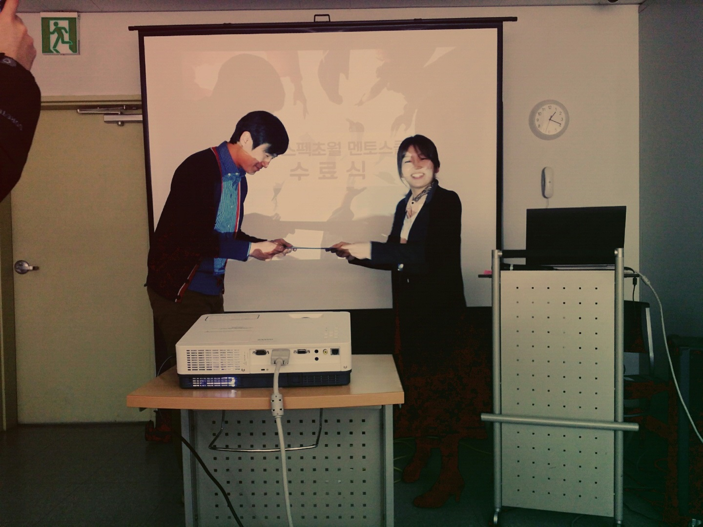
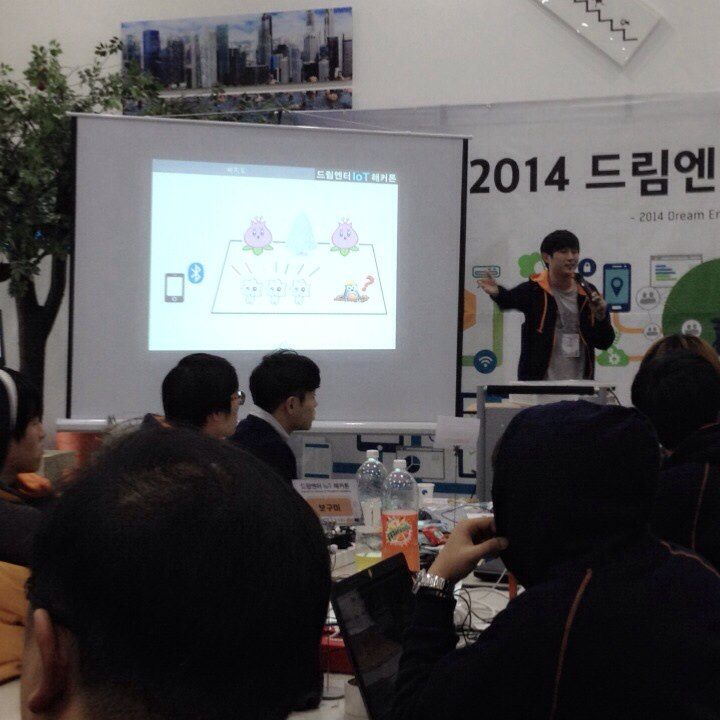

# Maker 활동 소개
대학 졸업 시기 부터 첫 직장 생활 사이에 약 1년간 활동 했던 Maker 활동에 대해 소개합니다. 취업을 미루고 이러한 활동을 한 계기는,

- 당시 주력 언어였던 Java 외 하드웨어를 직접 제어하는 저수준 언어를 경험하고 싶었습니다. 
- 막연하게 '무언가 어떤 시스템'라고만 생각했던 컴퓨터 기계장비와 내가 만드는 애플리케이션 사이 영역을 이해하고 싶었습니다.

때 마침 IoT 열풍과 함께 다양한 이벤트와 프로젝트를 경험할 기회가 많았고, 1년간 짧은 시간동안 겪었던 경험들을 소개합니다.

## 스펙초월 멘토스쿨
C언어를 사용하여 아두이노나 잘 알려진 MCU(Micro controller unit)를 사용해 펌웨어를 개발하는 방법을 배웠습니다. 교육 과정중 뜻이 맞는 동료들을 모아 메이커들이 모인다는 각종 세미나에 참여하고 어떤 경진대회를 준비하게 됩니다.

- 주차장 관리 시스템, 만차시 구석에서 트리가..?

- 나도 이제 메이커가 되는건가!?

## IoT 해커톤
무박 2일간 아두이노와 노트북, 스마트폰을 이용한 사물 인터넷 경진대회에 참가하였습니다. 사람이 접근하면 개화하고 설정값에 따라 LED 패턴이 변화하는 [속살꽃]을 출품하였습니다.

- 상세 설정을 제외한 프로그래밍을 마치고 [속살꽃]을 제작중인 나

- 밤이 깊어갈 수록 코드보다 외면의 아름다움(?)에 집착하는 우리들

- 비싼 돈주고사서 쓸줄 몰라 버릴뻔 했던 고급 모터의 사용법을 알려주신 (주)후본 대표님과

- 고퀄리티 프리젠테이션을 진행하는 나

- 대상보다 값지다는 [창조상]을 수상한 우리! 고생했다!

